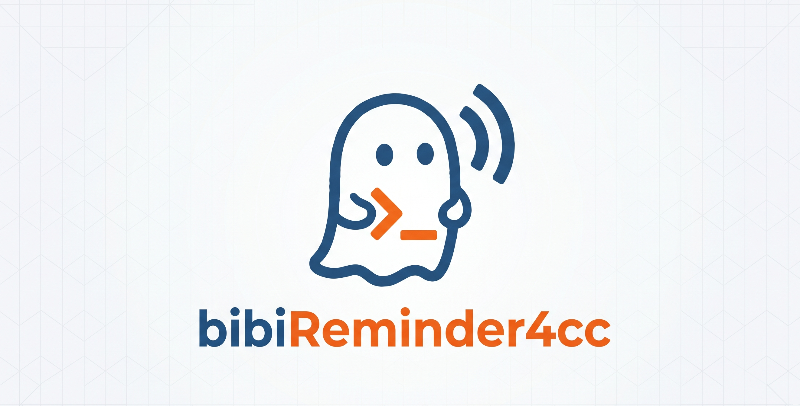
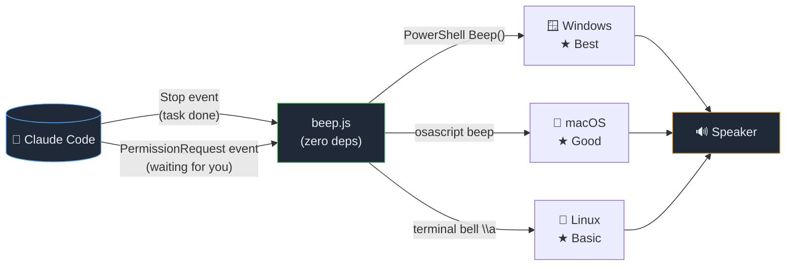

<p align="center">
  
</p>

<p align="center">
  <a href="LICENSE"></a>
  <a href="package.json"></a>
  
  
</p>

**Audible beep notifications for Claude Code.** Alt-tab freely — distinct beep sounds tell you exactly when CC needs your attention.

---

## 👂 Sound Patterns

Each event has its own distinct sound so you know what's happening without looking at the screen.


| Event | Pattern | Pitch | What's happening |
|-------|---------|-------|------------------|
| **Task complete** `Stop` | ▸▸ **High-high** | 1200Hz → 1500Hz | Claude finished responding — come check the result |
| **Permission needed** `PermissionRequest` | ▸▸ **Low-low** | 600Hz → 500Hz | Claude is waiting for you to allow/deny an action |

---

## ⚡ Quick Start

```bash
# Clone and install (project level)
git clone https://github.com/hsrxr/bibiReminder4cc.git
cd bibiReminder4cc
node install.js

# Or install globally (for all projects)
node install.js --global
```

That's it. The next time Claude Code finishes a task or hits a permission prompt, you'll hear it.

---

## 🔧 How It Works

bibiReminder4cc uses [Claude Code's hooks system](https://code.claude.com/docs/en/hooks) to intercept two lifecycle events.



**The installer:**
1. Adds `Stop` and `PermissionRequest` hooks to `.claude/settings.local.json`
2. Copies `beep.js` to `.claude/hooks/beep.js`
3. That's it — zero config, zero npm dependencies

---

## 🗑️ Uninstall

```bash
node uninstall.js           # Remove from current project
node uninstall.js --global  # Remove global install
```

---

## 💻 Platform Support

| Platform | Sound Method | Sound Quality |
|----------|-------------|---------------|
| Windows 10/11 | `[Console]::Beep()` via PowerShell | ★★★ Distinct pitched beeps |
| macOS | `osascript -e 'beep'` | ★★☆ System beep |
| Linux | Terminal bell (`\x07`) | ★☆☆ Basic beep |

---

## ❓ Troubleshooting

**🔇 No sound?**
- **Windows**: Ensure PowerShell is available (it's included with Windows 10/11)
- **macOS**: Make sure your system volume is on and not muted
- **Linux**: Check that your terminal emulator supports the bell character (`\a`). Enable "terminal bell" in your terminal settings
- **All platforms**: Verify Claude Code hooks are not disabled (`--bare` mode disables hooks)

**⛔ Hooks not firing?**
- Make sure you're not running Claude Code with `--bare` (it disables hooks)
- Check that `.claude/settings.local.json` contains the hooks section
- Verify `beep.js` exists at `.claude/hooks/beep.js`

**🤔 Permission prompt about running beep.js?**
- The first time a hook runs, Claude Code may ask for permission. Approve it once and it will be remembered.

---

## 📁 What Gets Modified

Only **one file** is modified:

- **`.claude/settings.local.json`** — the `hooks` section is added. All existing settings (`permissions`, etc.) are preserved exactly as-is.

One file is created:

- **`.claude/hooks/beep.js`** — the cross-platform beep script (52 lines, zero dependencies).

Both are local to the project and won't affect other projects (unless you use `--global`).

---

## 📦 Files

```
bibiReminder4cc/
├── beep.js          # Cross-platform beep script (core logic)
├── install.js       # One-shot installer
├── uninstall.js     # Clean uninstaller
├── package.json     # npm metadata
├── README.md        # This file
├── LICENSE          # MIT
└── media/
    ├── bbr4cc.png            # Project logo
    └── beep-patterns.svg     # Sound pattern visualization
```

---

## 🧪 Development

```bash
node beep.js --test   # Test both sound patterns
```

---

## 📄 License

MIT
